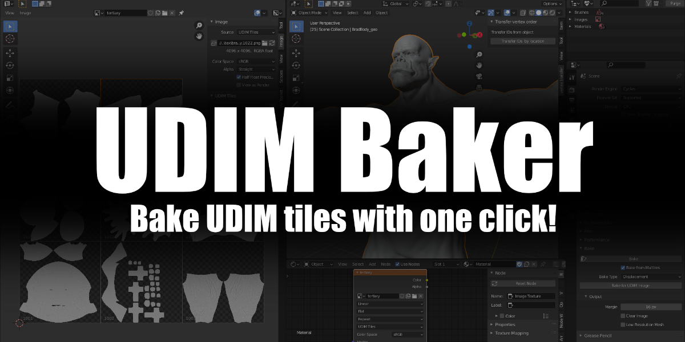

building on the code from Alfonso Annarumma: https://github.com/anfeo/blender_addon_bake_UDIM

# bake UDIMs in Blender

- Select Object
- go into edit mode and create desired amount of UDIM tiles
- once you made your tiles and filled them, go to "Image" in the UV editor
- click save
- exit edit mode in the 3D viewport
- go to the shader editor and create a image texture node
- Select UDIM data block
- make sure the texture node is selected
- Set Bake Parameters
- Click on Bake for UDIM Image

# Youtube Link

https://www.youtube.com/watch?v=msVZb_Ola5E&t=3s&ab_channel=AsgerLanghoff
